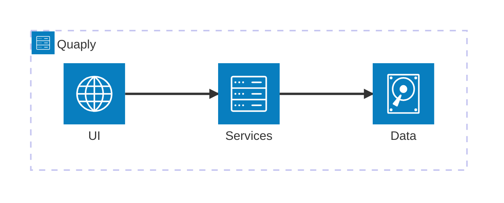
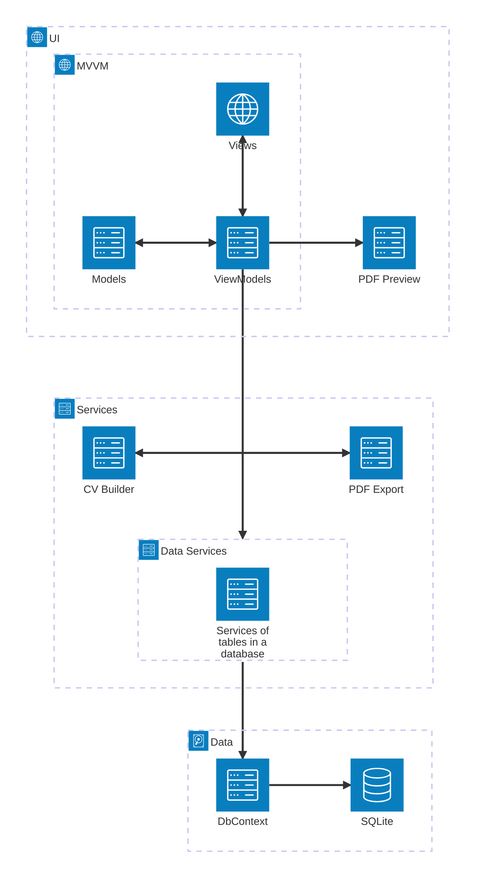

# Overview

```mermaid
architecture-beta
    group application(server)[Quaply]

    service ui(internet)[UI] in application
    service services(server)[Services] in application
    service data(disk)[Data] in application

    ui:R --> L:services
    services:R --> L:data

```

# Details

```mermaid
architecture-beta
    group ui(internet)[UI]
    group services(server)[Services]
    group data(disk)[Data]

    group mvvm(internet)[MVVM] in ui
    group data_services(server)[Data Services] in services

    service pdf_preview(server)[PDF Preview] in ui
    service models(server)[Models] in mvvm
    service views(internet)[Views] in mvvm
    service viewmodels(server)[ViewModels] in mvvm

    service cv_builder(server)[CV Builder] in services
    service pdf_export(server)[PDF Export] in services
    service table_services(server)[Services of tables in a database] in data_services

    service dbcontext(server)[DbContext] in data
    service sqlite(database)[SQLite] in data

    junction junctionPresentation in services

    viewmodels:T <--> B:views
    viewmodels:L <--> R:models
    viewmodels:R --> L:pdf_preview
    viewmodels:B -- T:junctionPresentation
    junctionPresentation:L --> R:cv_builder
    junctionPresentation:B --> T:table_services{group}
    junctionPresentation:R --> L:pdf_export
    table_services{group}:B --> T:dbcontext
    dbcontext:R --> L:sqlite
```