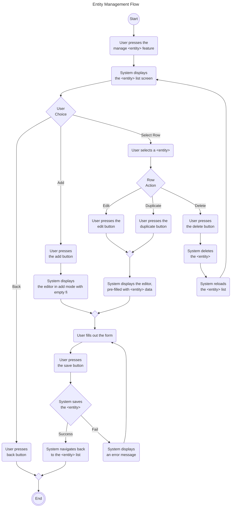

## Applies to Profile, WorkExperience, Certification, Project, Education...

```mermaid
---
title: Entity Management Flow
---
flowchart TD
    Start@{ shape: circle }
    End@{ shape: double-circle }

    ListDecision{User<br/>Choice}
    ListDecisionMerge{ }

    RowDecision{Row<br/>Action}
    RowDecisionMerge{ }

    ManageEntityButton(User presses the<br/>manage &lt;entity&gt; feature)
    EntityListScreen(System displays<br/>the &lt;entity&gt; list screen)
    BackButton(User presses<br/>back button)

    SelectEntity(User selects a &lt;entity&gt;)
    OpenFilledForm(System displays the editor,<br/>pre-filled with &lt;entity&gt; data)

    AddButton(User presses<br/>the add button)
    OpenAddForm(System displays<br/>the editor in add mode with empty fi)

    EditButton(User presses the<br/>edit button)
    DuplicateButton(User presses the<br/>duplicate button)
    EditOrDuplicateMerge{ }

    DeleteButton(User presses<br/>the delete button)
    DeleteState(System deletes<br/>the &lt;entity&gt;)
    DeleteSuccess(System reloads<br/>the &lt;entity&gt; list)

    EditForm(User fills out the form)
    SaveButton(User presses<br/>the save button)
    SaveState{System saves<br/>the &lt;entity&gt;}
    SaveSuccess(System navigates back<br/>to the &lt;entity&gt; list)
    SaveFail(System displays<br/>an error message)

    Start --> ManageEntityButton
    ManageEntityButton --> EntityListScreen
    EntityListScreen --> ListDecision

    ListDecision --> |Back| BackButton
        BackButton --> ListDecisionMerge

    ListDecision --> |Add| AddButton
        AddButton --> OpenAddForm
        OpenAddForm --> RowDecisionMerge

    ListDecision --> |Select Row| SelectEntity
        SelectEntity --> RowDecision

        RowDecision --> |Edit| EditButton
            EditButton --> EditOrDuplicateMerge

        RowDecision --> |Duplicate| DuplicateButton
            DuplicateButton --> EditOrDuplicateMerge

        EditOrDuplicateMerge --> OpenFilledForm
        OpenFilledForm --> RowDecisionMerge

        RowDecision --> |Delete| DeleteButton
            DeleteButton --> DeleteState
            DeleteState --> DeleteSuccess
            DeleteSuccess --> EntityListScreen

        EditForm --> SaveButton
        SaveButton --> SaveState
        SaveState -->|Success| SaveSuccess
            SaveSuccess --> ListDecisionMerge
        SaveState -->|Fail| SaveFail
            SaveFail --> EditForm

        RowDecisionMerge --> EditForm
    ListDecisionMerge --> End
```
